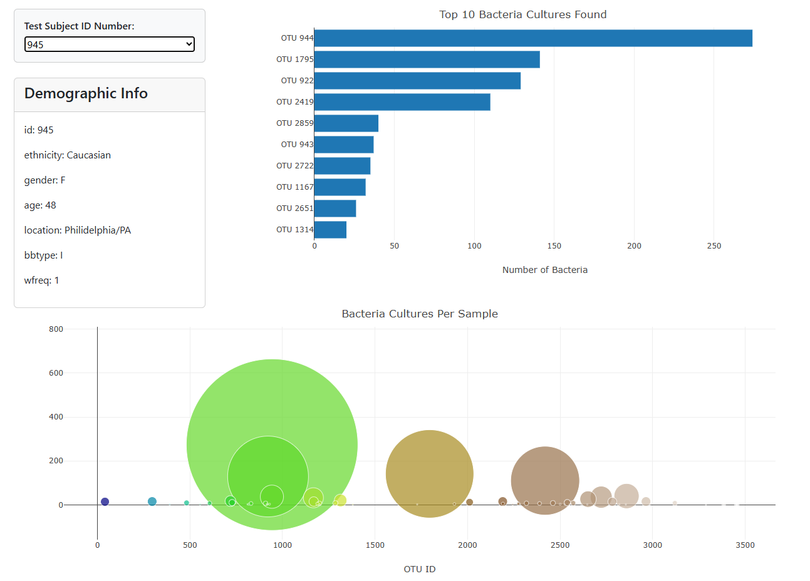
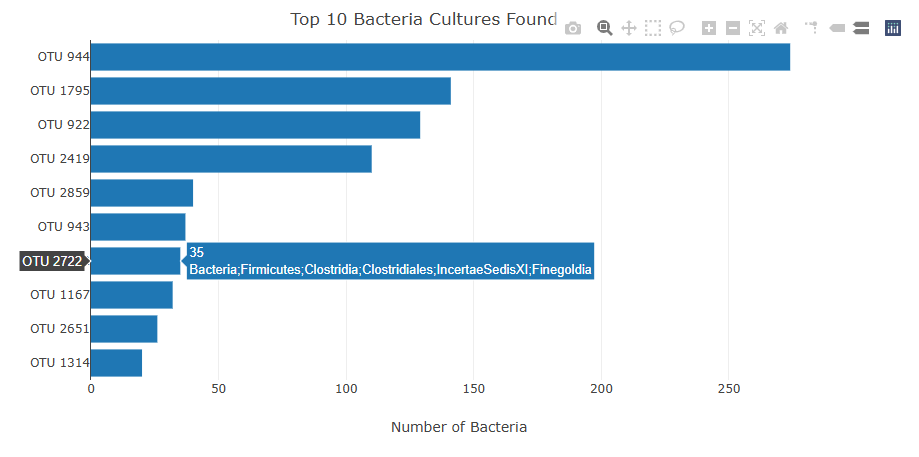
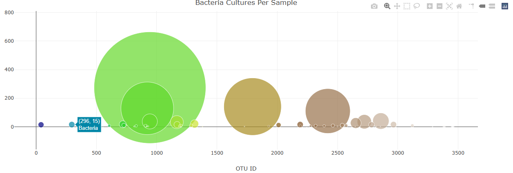
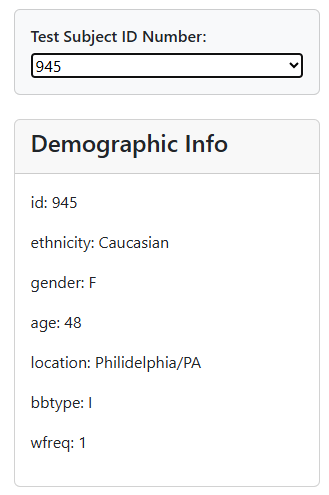

# JavaScript Assignment
All the code for the application logic has been implemented in the [`app.js`](./docs/static/js/app.js) file.

## Dashboard layout:

## Charts
Both charts initialize without error. When a new sample is selected, both charts update.

### Bar Chart
- Chart uses Top 10 sample values as values.
- Chart uses `otu_ids` as the labels.
- Chart uses `otu_labels` as the tooltip.

### Bubble Chart
- Chart uses Top 10 sample values as values.
- Chart uses `otu_ids` for the x values.
- Chart uses `otu_ids` for marker colors.
- Chart uses `sample_values` for the y values.
- Chart uses `sample_values` for the marker size.
- Chart uses `otu_labels` for text values.

## Metadata
- Metadata initializes without error.
- Metadata updates when a new sample is selected.

## Deployment
App successfully deployed to Github Pages ([link](https://arzingy.github.io/belly-button-challenge/)).
